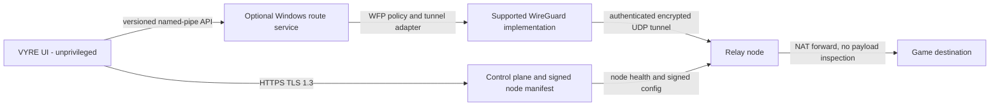

# VYRE relay architecture

**Status:** Phase 7 design baseline. No relay protocol implementation, control service, or deployed relay is active in VYRE 0.1.0.

## Goals and non-goals

The relay feature may be offered only when an actual node measures a better path to the same game destination than the direct connection. It must preserve the current local-first desktop app, keep game traffic out of unrelated routes where supported, and recover the original Windows route after errors, crashes, or removal.

This design does not promise lower ping, bypass anti-cheat, modify game packets, install an unsigned driver, or route all PC traffic by default. A relay cannot improve a path when the direct route is already better. Relay nodes can observe client source IP, destination IP, timing, and volume; application payloads must remain end-to-end encrypted by the game when the game provides that protection.

## Component boundaries

- **Desktop UI:** stays unprivileged. It requests explicit start, stop, benchmark, and status operations; it cannot submit arbitrary shell commands, filter rules, routes, keys, or executable paths.
- **Route service:** a separate, optional Windows service owns tunnel lifecycle and narrowly scoped route policy. It authenticates the caller using a per-user named-pipe ACL and verifies the connecting Windows identity. Every request uses a versioned schema, bounded fields, an allowlisted operation, and an idempotency identifier. It writes a recovery record before each route mutation.
- **Control plane:** returns a short-lived session authorization and a signed node manifest. The manifest contains node ID, region, endpoint, public key, allowed protocol/port, health timestamp, and expiry. The client validates the signature using a public key shipped with a signed VYRE release; TLS alone is not the manifest trust root.
- **Data plane:** use the maintained WireGuard implementation and its established Noise-based protocol rather than inventing cryptography or a VYRE-specific tunnel. Each client and relay authenticate each other by configured public key. Session keys are short lived; relay peer configuration is removed at session end or expiry.
- **Relay node:** forwards authenticated tunnel traffic to permitted public destinations and records only operational counters required for health and abuse prevention. It must not inspect, log, or rewrite game payloads. Egress restrictions and per-client rate limits prevent an unauthenticated or open proxy.

The WireGuard protocol uses the Noise IK handshake and authenticated encryption for its data plane. WFP ALE connect-redirect layers can change a connection's destination; Windows documents WFP callout drivers as the mechanism for filtering actions that require specialized processing. A production app-specific tunnel therefore requires a separately signed, reviewed Windows component and anti-cheat compatibility testing; the current app must not simulate this with game injection or undocumented hooks. See [WireGuard protocol](https://www.wireguard.com/protocol/), [Windows ALE layers](https://learn.microsoft.com/en-us/windows/win32/fwp/ale-layers), and [WFP callout driver guidance](https://learn.microsoft.com/en-us/windows-hardware/drivers/network/callout-driver-programming-considerations).

## Route selection and measurements

1. Identify the game process using the existing process catalogue. Resolve a game destination only from supported Windows connection metadata or an explicit user-selected server endpoint. Do not guess a game server from a generic public probe.
2. For each candidate, measure the direct path and relayed path to the **same destination with the same probe method**. A relay's own ping is a node-health signal only; it is not evidence of game-server latency. If the destination does not support the probe, label the result unavailable rather than substituting a different host.
3. Collect repeated windows of RTT samples and record median RTT, p95 absolute deviation from the median, loss, sample count, route identity, target, and timestamp. Discard incomplete or incomparable windows.
4. Rank a route with a transparent score in milliseconds: `median RTT + 2 × p95 absolute deviation + 1000 × loss fraction`. This is a tunable starting heuristic, not a prediction of player experience. Show the component measurements beside the score.
5. Keep the direct route as the initial and recovery route. Auto-select only after at least three comparable windows agree that the relay score is better by a configured margin and the relay passes loss and health limits. Require a sustained regression before switching away to avoid route flapping. Keep a manual Direct option.
6. Store the route selected, comparison measurements, and every transition in local session history. Never claim a ping reduction unless the same-target measurements support it; show the exact measurement window and sample size.

The first implementation should support an explicit target and manual route comparison. Automatic game-server discovery and automatic route selection remain gated on validated per-game endpoint coverage and real-world stability data. Existing VYRE readings to `1.1.1.1` must not be repurposed as game-server benchmarks.

## Traffic scope

The default policy is Direct. The initial relay prototype may use a dedicated tunnel adapter with only explicitly selected destination prefixes routed through it. Process-only routing is a separate capability: it requires a reviewed Windows Filtering Platform design for IPv4 and IPv6, correct game executable identity, UDP and TCP coverage, child-process behavior, DNS behavior, and protection against accidental traffic leakage.

If a reviewed app-specific implementation is not available, VYRE must label the limitation and ask for explicit user selection of a supported route scope. It must not quietly use a full-device tunnel while describing it as game-only. IPv6, DNS, loopback, local network, and non-game traffic behavior must be defined and tested before enabling any split route.

## Lifecycle, failure handling, and privacy

- Save exact original route/filter/adapter state and the owning VYRE session ID before applying any change. Give each temporary object a unique VYRE provider/session identifier so cleanup cannot delete unrelated Windows policy.
- Start the tunnel and confirm its authenticated peer and route health before changing game traffic. Stage all filters before activation and roll back if any stage fails.
- Keep a watchdog in the route service. On a missed relay heartbeat, service crash, UI disconnect, Windows restart, user stop, game exit, or uninstall, remove only VYRE-owned filters and return traffic to Direct. The user interface must show the transition and reason.
- Do not block normal Windows connectivity by default when a route fails. Do not retry a stale node endpoint or silently change to another region. Automatic failover is enabled only after the replacement path passes the same health checks.
- Keep device keys in Windows-protected storage and never include private keys, full destination history, or packet data in diagnostic exports. Relay logs use rotating pseudonymous session IDs and short retention, with explicit notice that relay operators see network metadata.
- A one-time session must expire server-side. Revocation must stop new sessions and prevent a removed node from receiving fresh client configuration.

## Phase 7 acceptance gates

This document completes the architecture decision portion of Phase 7. The remaining Phase 7 work is implementation and evidence; Phase 8 node deployment does not begin until these gates pass:

- A protocol interoperability test validates client/relay key authentication, expiry, replay resistance, configuration signature checks, and revocation.
- The relay rejects unauthenticated peers and disallowed egress, enforces resource limits, and cannot act as an open proxy.
- Direct and relayed route measurements use identical targets and methods, include loss and variation, and persist a reproducible record.
- IPv4, IPv6, DNS, sleep/resume, adapter changes, relay loss, service crash, app crash, reboot recovery, game exit, and uninstall all return to the declared route policy.
- A signed Windows service/driver package passes clean install, upgrade, rollback, and removal tests. Any WFP callout is reviewed for least privilege and does not inspect or alter game payloads.
- Compatibility testing covers supported games and anti-cheat configurations. Any conflict disables the relay for that configuration; no bypass is attempted.
- At least one operator-controlled node exists and has published health, region, capacity, maintenance, egress, logging, and retention policies before VYRE displays a relay as available.

## Implementation order

1. The relay-independent score model and deterministic tests are implemented in `src-tauri/src/relay.rs`; keep it disconnected from the UI until real comparable measurements can feed it.
2. Implement signed node-manifest parsing and signature/expiry rejection tests.
3. Prototype the service-to-tunnel lifecycle against a local test relay, first with an explicit destination prefix and a watchdog restore journal.
4. Evaluate process-aware WFP routing, IPv4/IPv6 and DNS behavior, and anti-cheat conflicts. Do not enable game-only routing until that evaluation is successful.
5. Add Smart Route UI only after the route comparison command returns measured candidate data. Keep all relay pages in a clear unavailable state until a deployed node and passing acceptance gates are present.

